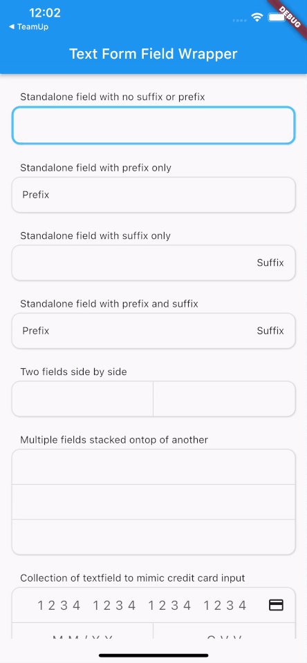

A Widget that wraps a TextFormField widget for the puspose of decorating it with a
border and radiused corners that can be easily adjusted for TextFormFields that need
to be placed against one another.



## Installation

In the `pubspec.yaml` of your flutter project, add the following dependency:
 ``` yaml dependencies:
 text_form_field_wrapper: ^1.0.0
```
Import it to each file you use it in:
 ``` dart
 import 'package:text_form_field_wrapper/text_form_field_wrapper.dart';
 ```

## Usage

### Example 1

This example is a very basic, single standalone TextFormFieldWrapper.

``` dart
TextEditingController myController = TextEditingController();

TextFormFieldWrapper(
    formField: TextFormField(
      controller: myController,
      decoration: const InputDecoration(
          border: InputBorder.none),
    ),
    position: TextFormFieldPosition.alone,
),
```

### Example 2

This example shows a text field placed over a row containing two textfields.

``` dart
TextEditingController myController1 = TextEditingController();
TextEditingController myController2 = TextEditingController();
TextEditingController myController3 = TextEditingController();

Column( children: [
    TextFormFieldWrapper(
    formField: TextFormField(
        controller: myController1,
        decoration: const InputDecoration(
            border: InputBorder.none),
        ),
    position: TextFormFieldPosition.top,
    ),
    Row( children: [
        Expanded( child: TextFormFieldWrapper(
            formField: TextFormField(
                controller: myController2,
                decoration: const InputDecoration(
                    border: InputBorder.none),
                ),
            position: TextFormFieldPosition.bottomLeft,
        ),
        ),
        Expanded( child: TextFormFieldWrapper(
            formField: TextFormField(
                controller: myController3,
                decoration: const InputDecoration(
                    border: InputBorder.none),
                ),
            position: TextFormFieldPosition.bottomRight,
            ),
        ),
    ]),
]),
```


## Additional information

TODO: Tell users more about the package: where to find more information, how to 
contribute to the package, how to file issues, what response they can expect 
from the package authors, and more.


- Is there a _bug_ in the code? [File an issue][issue].

If a feature is missing (the Dart language is always evolving) or you'd like an
easier or better way to do something, consider [opening a pull request][pull].
You can always [file an issue][issue], but generally speaking feature requests
will be on a best-effort basis.

[issue]: https://github.com/jonesw5/text_form_field_wrapper/issues
[pull]: https://github.com/jonesw5/text_form_field_wrapper/pulls